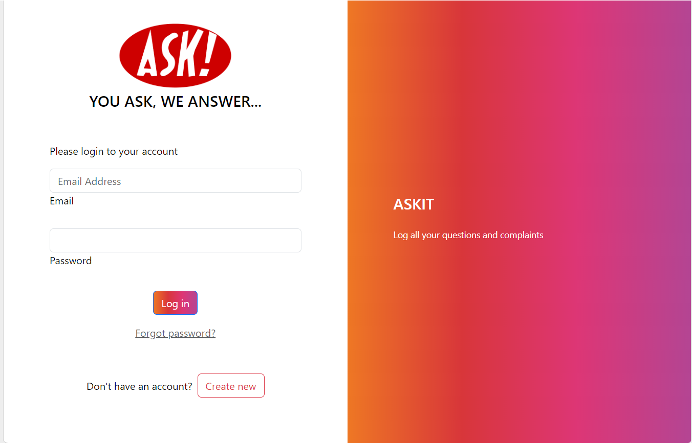
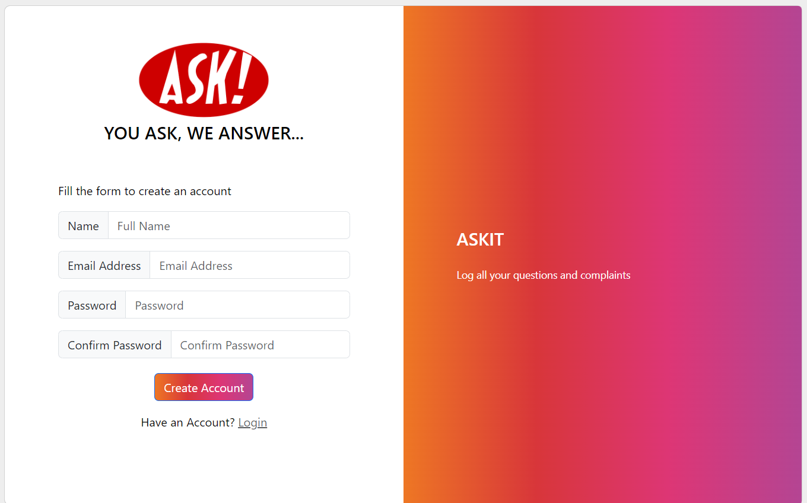
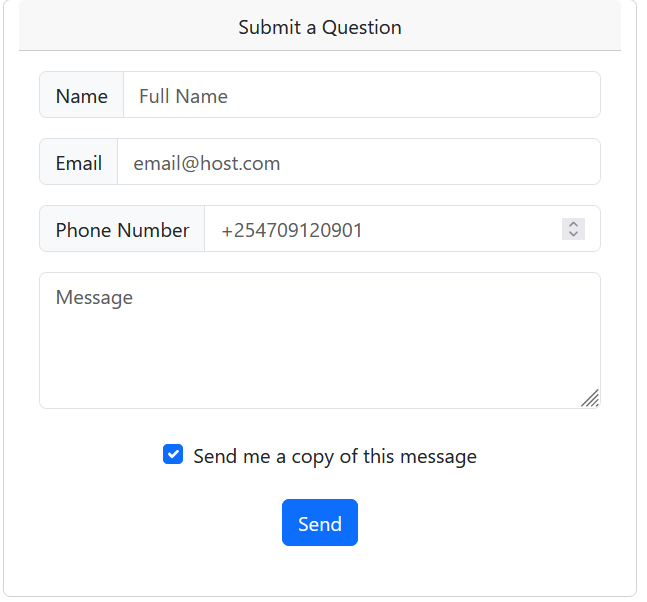
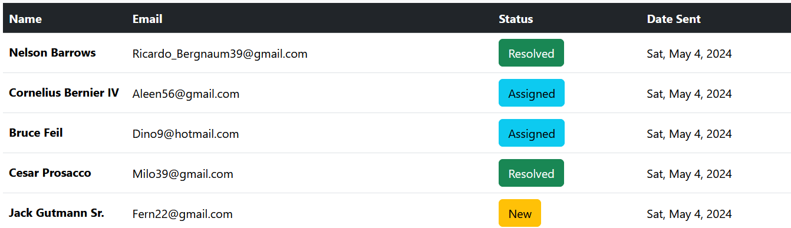
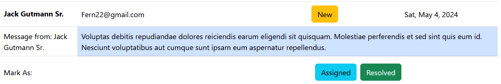

# Contact Form in Angular and Laravel
A simple contact form to allow users to send inquiries to the support team.

## Technologies used
  [Angular js](https://angular.io/) for the frontend
  [Laravel](https://laravel.com/) for the backend
  [Sqlite](https://en.wikipedia.org/wiki/SQLite) for data storage

  ## Requirements
 [Node.js, NPM](https://nodejs.org/en/download) version 18.14.0
 [Angular CLI](https://angular.io/cli) version 17.3.6
 [PHP](https://www.php.net/manual/en/install.php) version 8.1
 [Composer](https://getcomposer.org/download/) version 2.6.1

## Implemented endpoints
Postman Collection Documentaion can be found [here](https://interstellar-flare-856825.postman.co/workspace/38d994db-b21b-4611-a20c-4691f1075dc5/documentation/19904898-cb0ce05f-cbf6-4e61-bdd7-77a45aec8994)
A postman collection with all implemented endpoints can be found [here](/backend/Inquiry_Submission_System.postman_collection.json)

##### Login Screen 
This is form is used to login existing users. 

  On the web frontend this is accessible through http://localhost:4200/login. On submission it sends a POST request to http://127.0.0.1:8000/api/login
  

##### Registration
This is form is used to create a new user. 

  On the web frontend this is accessible through http://localhost:4200/register. On submission it sends a POST request to http://127.0.0.1:8000/api/register

##### Inquiry Submission Form
This is form is used to submit an inquiry

  On the web frontend this is accessible through http://localhost:4200/send. On submission it sends a POST request to http://127.0.0.1:8000/api/inquries/add

##### All Inquiries view
This is a table that shows all the inquiries submitted to the system. To access this endpoint requires a user to be authenticated with a bearer token this is obtained after a login/registration. 

  On the web frontend this is accessible through http://localhost:4200/inquiries. On submission it sends a POST request to http://127.0.0.1:8000/api/inquries

##### Single Inquiry View
This is a view appears when you click on a single inquiry row. If the "Asssigned" or "Resolved" buttons in the "Mark As" sesction are clicked, they send a put request to http://127.0.0.1:8000/api/inquiries/update/{id} which changes the status of the inquiry. 

To access this endpoint requires a user to be authenticated with a bearer token this is obtained after a login/registration.  

| Status    | Meaning     | 
| ------------ | ------------ | 
| New | Indicates that an inquery has been received and not yet processed|
| Assigned | Indicates that the inquiry has been assigned to a staff member adn is being worked on | 
| Resolved | Indicates that the inquiry has been followed up on and ticket closed. | 

## Additional Dependencies
Inbuilt packages were utilized for both the frontend and backend. Here is a list of additional requiremetns that were added. 
### Frontend
 Bootstrap version 5.3.3 - for styling of visual components

### Backend
Passport version 12.0 - for authentication

## How to run the application
1. Clone this repository: `git clone https://github.com/momutuku/AskIt.git`
   ### Backend
      1. Navigate to the folder named backend
      2. Make a copy of the file `env.example` and rename it to `.env`
      3. By default the project runs on sqlite database. To use MySQL uncomment the database section and fill in required details
      4. Open the command prompt and run `composer install` to install required packages
      5. Run `php artisan migrate` to create all database tables. Incase the sqlite database does not exist select yes when prompterd to create the database file.
      6. Run `php artisan serve` to start the server
      7. Endpoints can be accessed through port 8000 on localhost http://127.0.0.1:8000
   ### Frontend
     1. Navigate to the folder named frontend
     2. Run `npm install` to install all required packages
     3. Run `npm start` to start the application
     4. The site runs on port 4200. I  can be accessed through http://localhost:4200